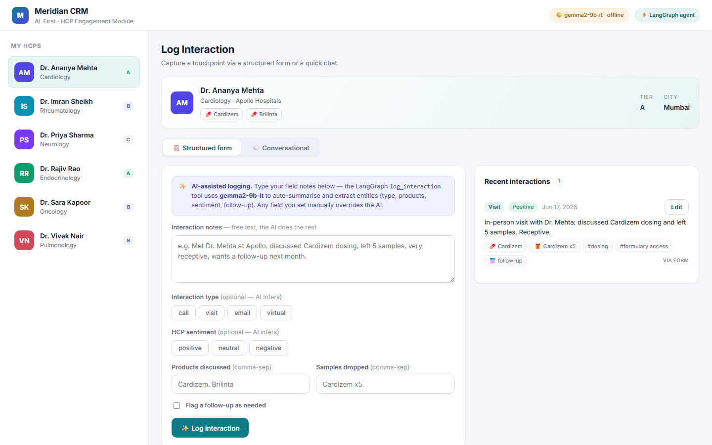

# Meridian CRM — AI-First HCP Module · *Log Interaction* Screen

An AI-first Customer Relationship Management (CRM) module for pharmaceutical field
representatives. It reimagines the single most repeated task in a rep's day — **logging
an interaction with a Healthcare Professional (HCP)** — around an LLM agent, so notes
become structured, queryable CRM records with zero form-filling friction.

The *Log Interaction* screen offers **two ways to log the same interaction**:

1. **Structured form** — familiar fields, but AI-assisted: the rep types free notes and
   the agent auto-summarises and extracts entities.
2. **Conversational chat** — the rep briefs the CRM in natural language and a **LangGraph**
   agent decides which tool to run (log, edit, look up history, fetch HCP details, schedule
   a follow-up).



---

## Tech stack

| Layer | Choice |
|---|---|
| Frontend | **React 18 + Redux Toolkit + Vite**, Google **Inter** font |
| Backend | **Python + FastAPI** (async) |
| Agent framework | **LangGraph** (`StateGraph`) |
| LLM | **Groq · `gemma2-9b-it`** (via the OpenAI-compatible endpoint); `llama-3.3-70b-versatile` documented as a drop-in router alternative |
| Database | **PostgreSQL** (docker-compose) with a zero-install **SQLite** fallback for local dev |

---

## Quick start

### Option A — one command (Docker)

```bash
cp .env.example .env          # then edit LLM_API_KEY with your Groq token
docker compose up --build
# open http://localhost:3000
```

### Option B — local dev (no Docker)

```bash
# 1) Backend  (SQLite, zero-install)
cd backend
python -m venv .venv && . .venv/Scripts/activate    # macOS/Linux: source .venv/bin/activate
pip install -r requirements.txt
cp .env.example .env          # set LLM_API_KEY; DATABASE_URL defaults to SQLite
uvicorn app.main:app --reload --port 8000

# 2) Frontend  (new terminal)
cd frontend
npm install
npm run dev                    # http://localhost:5173 (proxies /api to :8000)
```

> **Groq token.** Create one at <https://console.groq.com/keys> and put it in `.env` as
> `LLM_API_KEY`. Without a key the app still runs end-to-end in an **offline fallback**
> (deterministic heuristics stand in for the model) so the flows are demonstrable without
> network access — the header badge shows `gemma2-9b-it · offline` until a key is set.

---

## Architecture

```
 React + Redux + Vite (Inter)          FastAPI (async)                LangGraph agent            Groq
┌───────────────────────────┐  HTTP   ┌──────────────────────┐       ┌────────────────────┐    gemma2-9b-it
│ Log Interaction screen     │ ──────▶ │ /api/v1/interactions │ ────▶ │ StateGraph:         │──▶ (OpenAI SDK →
│  • Structured form (tab)   │        │   POST · GET · PATCH  │       │  load_context       │    Groq endpoint)
│  • Conversational chat(tab)│ ◀────── │ /api/v1/chat  (agent)│ ◀──── │  → router (JSON)    │
│ HCP sidebar + timeline     │        │ /api/v1/hcps · /health│       │  → execute_tool     │
└───────────────────────────┘        └──────────┬───────────┘       │  → responder        │
   Redux slices: hcps /                          │ async SQLAlchemy   └─────────┬──────────┘
   interactions / chat            Postgres (docker) / SQLite (dev)      5 CRM tools
```

Both the form and the chat funnel into the **same agent tools**, so the AI logic lives in
exactly one place (`backend/app/agent/tools.py`). A form submit calls `log_interaction`
directly; a chat message goes through the full graph.

---

## The LangGraph Agent

### Role

The LangGraph agent is the **reasoning layer** of the CRM. On every rep message it:

1. **`load_context`** — loads the selected HCP's profile and last few interactions from the DB,
   so the agent reasons *with* the relationship, not blind.
2. **`router`** — asks `gemma2-9b-it` (in JSON mode) which single tool best serves the rep's
   intent, returning `{ "tool": ..., "args": {...} }`.
3. **`execute_tool`** — runs that tool inside a DB transaction.
4. **`responder`** — writes a short, natural confirmation and, where useful, a **next-best-action**
   nudge.

In short, it turns messy field notes into structured, queryable CRM records and keeps the rep
in a fast conversational loop instead of form-filling.

> **Why JSON routing and not native tool-calling?** `gemma2-9b-it` on Groq does **not** reliably
> support the native OpenAI `tools=` function-calling parameter. So the agent does **not** use
> `bind_tools`; instead the router node uses **JSON mode** (`response_format={"type":"json_object"}`),
> which gemma2 handles well, and the graph executes the chosen tool deterministically. The router
> model is configurable (`LLM_MODEL_ROUTER`) — point it at `llama-3.3-70b-versatile` for stronger
> reasoning with no code change.

The graph is compiled **once** at startup (FastAPI lifespan) and reused for every request.

### The 5 tools

Defined in `backend/app/agent/tools.py`:

#### 1. `log_interaction` *(captures interaction data)*
The core capability. Pipeline:
- **Input**: `hcp_id` + `raw_notes` (a chat message or the form's notes field), plus any
  structured fields the rep set explicitly.
- **LLM summarisation + entity extraction**: `gemma2-9b-it` (JSON mode) converts the notes into
  a structured record — a concise **summary**, plus extracted **interaction_type**,
  **products_discussed**, **samples_dropped**, **sentiment**, **key_topics**, and a
  **follow_up_needed** flag.
- **Merge**: rep-provided fields override the model's guesses (the human is the source of truth).
- **Persist**: writes an `Interaction` row (`source = 'form' | 'chat'`) and returns it.
- **Robustness**: a heuristic extractor backfills any field the model omits, so a record is always
  well-formed (and the tool still works in offline mode).

This one tool powers **both** UI modes — the form POST and the chat "log a call…" both call it.

#### 2. `edit_interaction` *(modifies logged data)*
- **Structured mode**: the form's *Edit* modal sends an explicit field patch (`PATCH /interactions/{id}`).
- **Natural-language mode**: in chat ("*actually, change the sentiment to positive and note we
  discussed dosing*"), `gemma2-9b-it` is given the current record + the instruction and returns a
  **field-level patch**.
- Every patch is validated against an **allow-list** of editable fields (and enum checks for
  type/sentiment) before being applied; `updated_at` is bumped. If no `interaction_id` is supplied
  in chat, the HCP's most recent interaction is edited — matching the natural "*change that*" flow.

#### 3. `get_interaction_history`
Returns an HCP's recent interactions (newest first) so the rep can ask "*what did we discuss last time?*"
and the agent can ground follow-ups in real history.

#### 4. `get_hcp_details`
Looks up an HCP by id or **fuzzy name** → profile (specialty, institution, tier, preferred products).
Lets the chat resolve "*log a call with Dr. Rao*" to the right record.

#### 5. `schedule_followup`
Creates a `FollowUp` (due date + purpose), optionally linked to an interaction — the basis for a
**next-best-action** the responder can surface.

---

## Data model

`backend/app/models.py` — three tables (JSON columns are portable across Postgres & SQLite):

- **HCP** — `name, specialty, institution, tier (A/B/C), preferred_products[], email, city`
- **Interaction** — `hcp_id, rep_name, interaction_type, interaction_date, channel,
  products_discussed[], samples_dropped[], sentiment, key_topics[], summary, raw_notes,
  follow_up_needed, source, created_at, updated_at`
- **FollowUp** — `hcp_id, interaction_id?, due_date, purpose, status`

Tables are created and seeded (6 realistic HCPs + sample interactions) on startup — idempotent.

---

## API

| Method | Path | Purpose |
|---|---|---|
| `GET`  | `/health` | status + which model / DB is active |
| `GET`  | `/api/v1/hcps` · `/api/v1/hcps/{id}` | HCP directory |
| `GET`  | `/api/v1/interactions?hcp_id=` | list interactions |
| `POST` | `/api/v1/interactions` | **form log** → `log_interaction` (AI-enriched) |
| `PATCH`| `/api/v1/interactions/{id}` | **structured edit** → `edit_interaction` |
| `POST` | `/api/v1/chat` | **conversational** → full LangGraph agent |

Interactive docs at `http://localhost:8000/docs`.

---

## Project layout

```
ai-crm-hcp/
├─ docker-compose.yml          # db + backend + frontend, one command
├─ backend/
│  └─ app/
│     ├─ main.py               # FastAPI app, lifespan builds the agent once
│     ├─ config.py             # pydantic-settings
│     ├─ models.py schemas.py  # ORM + API models
│     ├─ db/session.py         # async SQLAlchemy engine + session_scope()
│     ├─ llm/client.py         # Groq via OpenAI SDK (+ json_chat, offline fallback)
│     ├─ agent/
│     │  ├─ graph.py           # LangGraph StateGraph (load→router→tool→respond)
│     │  ├─ tools.py           # the 5 tools
│     │  ├─ prompts.py state.py
│     └─ api/routes/           # health · hcps · interactions · chat
└─ frontend/
   └─ src/
      ├─ store/                # Redux Toolkit slices: hcps · interactions · chat
      ├─ api/client.js         # single fetch helper
      ├─ components/           # LogInteractionScreen, InteractionForm, ChatPanel,
      │                        # HcpSidebar, InteractionList, EditInteractionModal
      └─ theme.css             # Inter-based design system
```

---

## Try it

**Form mode** — select an HCP, type: *"Quick visit with Dr. Mehta, discussed Cardizem dosing,
left 5 samples, very positive, wants a follow-up next month"* → the record comes back with an
auto **summary**, `type=visit`, `sentiment=positive`, `samples=[Cardizem x5]`, `follow_up_needed=true`.

**Chat mode** — switch to the *Conversational* tab:
- *"log a virtual visit with Dr. Rao about the new Jardiance label, neutral tone"* → agent runs
  `log_interaction`.
- *"actually change the sentiment to positive"* → agent runs `edit_interaction` on the last record.
- *"what did we discuss recently?"* → agent runs `get_interaction_history`.
